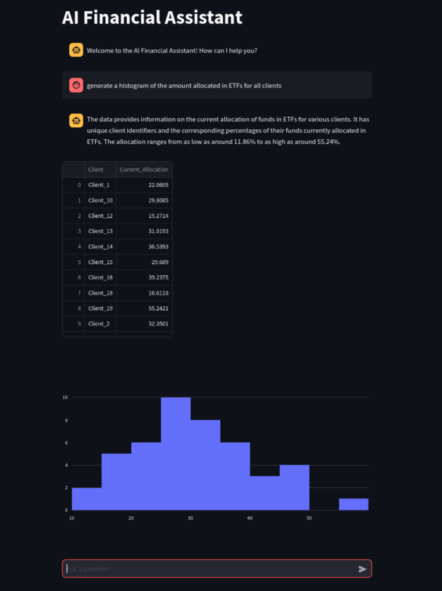

# FinancialAdvisor

Simple financial advisor built using Streamlit, Vanna, Langchain and OpenAI GPT 4o

## Installation:

```sh
git clone https://github.com/marceloprates/FinancialAdvisor.git
cd FinancialAdvisor
pip install -r requirements.txt
```

## Run:

```
streamlit run app.py
```

## How to use:




